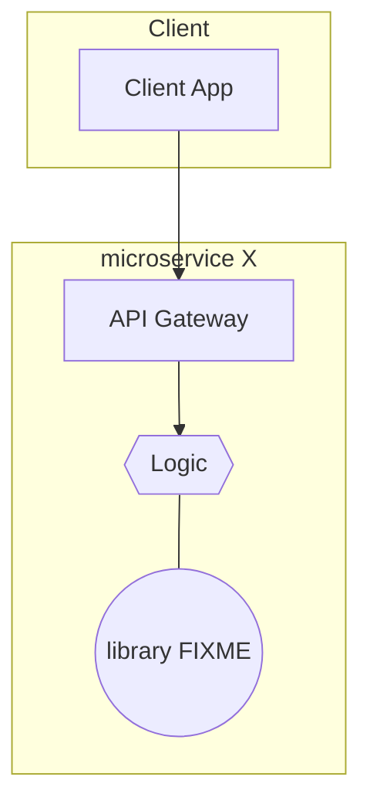

# <LIBRARY_NAME> - Software Design Document (SDD)

## Overview

This document details the software implementation of FIXME library.

This library contains the implementation and testing for FIXME

Attribute | Description
--- | ---
Status | Draft

## Related Documents

Document | Description
--- | ---
[Concept of Operations (CONOPS) (FIXME)](./FIXME) | Overview of the scope and duties of this module.
[Requirements & User Stories (FIXME)](./FIXME) | Requirements and user stories for this module.

## Module Attributes

Attribute | Applies | Explanation
--- | --- | ---
Safety Critical | Y | 
Realtime | Y |

## Global Variables

**Statically Allocated Queues**

FIXME

**State Machine Status**

FIXME

## Interfaces

For a refresher of the processes in the Arrow backend, please see the [top level README.md](../README.md).

FIXME Explanation of the above graph

## Tests

### Unit Tests

Rust unit testing framework. FIXME

### Integration Tests

Rust integration testing framework. FIXME
