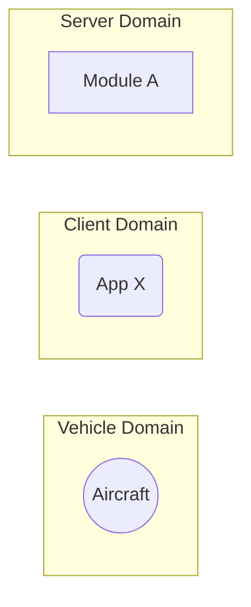

# \<LIBRARY NAME\> - Software Design Document (SDD)

## Overview

This document details the software implementation of FIXME.

This library is responsible for FIXME

Attribute | Description
--- | ---
Status | Draft

## Related Documents

Document | Description
--- | ---
FIXME | FIXME

## Module Attributes

Attribute | Applies | Explanation
--- | --- | ---
Safety Critical | ? | 
Realtime | ? |

## Global Variables

**Statically Allocated Queues**

FIXME

## Interfaces

For a refresher of the processes in the Arrow backend, please see the [top level README.md](../README.md).

FIXME description of the graph.

## Tests

FIXME

### Unit Tests

FIXME
